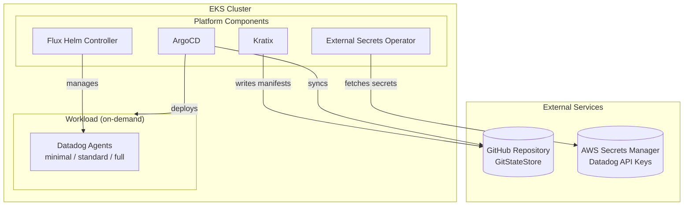

# Kratix Demo

A demonstration of [Kratix](https://kratix.io) for building self-service platform capabilities on Kubernetes. This repository implements an on-demand Datadog observability stack that can be provisioned via a simple `kubectl apply`.

## Architecture



## Components

| Component                     | Purpose                                     |
| ----------------------------- | ------------------------------------------- |
| **ArgoCD**                    | GitOps controller for all deployments       |
| **Kratix**                    | Platform orchestrator for self-service APIs |
| **External Secrets Operator** | Syncs secrets from AWS Secrets Manager      |
| **Flux Helm Controller**      | Manages HelmReleases generated by Kratix    |
| **Datadog**                   | On-demand observability stack (the Promise) |

## Repository Structure

```
.
├── iac/                          # OpenTofu for EKS cluster, VPC, IRSA
├── kubernetes/
│   ├── argocd/                   # ArgoCD OpenTofu + Application manifests
│   │   └── apps/                 # ArgoCD Applications
│   ├── kratix/                   # GitStateStore + Destination
│   └── external-secrets/         # ClusterSecretStore + ExternalSecrets
├── promises/
│   ├── promise.yaml              # DatadogStack Promise definition
│   ├── pipelines/
│   │   └── datadog-configure/    # Go pipeline + tiered Helm values
│   └── examples/                 # Sample DatadogStack resources
├── gitops/
│   └── platform/                 # Kratix-generated manifests (auto-populated)
└── .github/
    └── workflows/                # CI/CD for pipeline image
```

## DatadogStack API

```yaml
apiVersion: platform.srekubecraft.io/v1alpha1
kind: DatadogStack
metadata:
  name: production
  namespace: default
spec:
  tier: full # minimal, standard, or full
  environment: prod # maps to secret: datadog/<environment>/api-keys
  clusterName: kratix-demo
```

### Tiers

| Tier         | Features                                    | Resource Usage  |
| ------------ | ------------------------------------------- | --------------- |
| **minimal**  | Basic metrics, Cluster Agent                | ~256MB RAM/node |
| **standard** | Metrics + APM + Logs + Service Monitoring   | ~512MB RAM/node |
| **full**     | All features (NPM, Security, Process, etc.) | ~2GB RAM/node   |

## Prerequisites

- AWS account with permissions for EKS, IAM, Secrets Manager
- OpenTofu/Terraform installed
- kubectl configured
- GitHub account (for GitStateStore)

## Quick Start

### 1. Deploy Infrastructure

```bash
cd iac
tofu init
tofu apply
```

### 2. Configure kubectl

```bash
aws eks update-kubeconfig --name kratix-demo --region <region> --profile <profile>
```

### 3. Deploy ArgoCD

```bash
cd kubernetes/argocd
tofu init
tofu apply
```

### 4. Deploy Platform Components

```bash
# Apply all ArgoCD Applications
kubectl apply -f apps/

# Wait for components to be ready
kubectl get applications -n argocd -w
```

### 5. Configure Kratix

```bash
# Apply GitStateStore and Destination
kubectl apply -f ../kratix/

# Apply ClusterSecretStore
kubectl apply -f ../external-secrets/
```

### 6. Create Datadog API Keys in AWS

```bash
# Create secret for each environment
aws secretsmanager create-secret \
  --name "datadog/prod/api-keys" \
  --secret-string '{"api-key":"YOUR_API_KEY","app-key":"YOUR_APP_KEY"}' \
  --region <region> --profile <profile>
```

### 7. Install the Promise

```bash
kubectl apply -f ../../promises/promise.yaml
```

### 8. Request a DatadogStack

```bash
# Choose a tier: minimal, standard, or full
kubectl apply -f ../../promises/examples/full-tier.yaml

# Watch the pipeline execute
kubectl get datadogstacks -w

# Check Datadog pods
kubectl get pods -n datadog-production
```

### 9. Remove Datadog

```bash
kubectl delete datadogstack production
```

## Taskfile Commands

This repository uses [Task](https://taskfile.dev) for automation.

| Command                    | Description                            |
| -------------------------- | -------------------------------------- |
| `task setup`               | Full setup (infra + ArgoCD + platform) |
| `task teardown`            | Full teardown                          |
| `task status`              | Show status of all components          |
| `task datadog:full`        | Deploy Datadog with full tier          |
| `task datadog:standard`    | Deploy Datadog with standard tier      |
| `task datadog:minimal`     | Deploy Datadog with minimal tier       |
| `task datadog:delete`      | Remove all DatadogStack resources      |
| `task argocd:password`     | Get ArgoCD admin password              |
| `task argocd:port-forward` | Port forward ArgoCD UI                 |
| `task pipeline:trigger`    | Trigger pipeline build workflow        |

Run `task --list` to see all available commands.

## CI/CD Pipeline

The GitHub Actions workflow automatically:

1. Lints Go code with `golangci-lint`
2. Builds and pushes Docker image to `ghcr.io`
3. Updates `promises/promise.yaml` with new image tag
4. Commits changes back to repository

Trigger manually:

```bash
gh workflow run "Build Kratix Pipeline"
```

## Troubleshooting

| Issue                | Resolution                                                              |
| -------------------- | ----------------------------------------------------------------------- |
| Pipeline stuck       | `kubectl logs -l kratix.io/promise-name=datadog-stack`                  |
| ArgoCD OutOfSync     | `kubectl annotate app <name> -n argocd argocd.argoproj.io/refresh=hard` |
| ExternalSecret error | Check IAM policy and ClusterSecretStore status                          |
| OOMKilled pods       | Increase memory in tier values file                                     |

## Related

- [Blog Post: Kratix - Building Self-Service Platform Capabilities](https://srekubecraft.io/posts/kratix/)
- [Kratix Documentation](https://docs.kratix.io)
- [Syntasso](https://syntasso.io)


