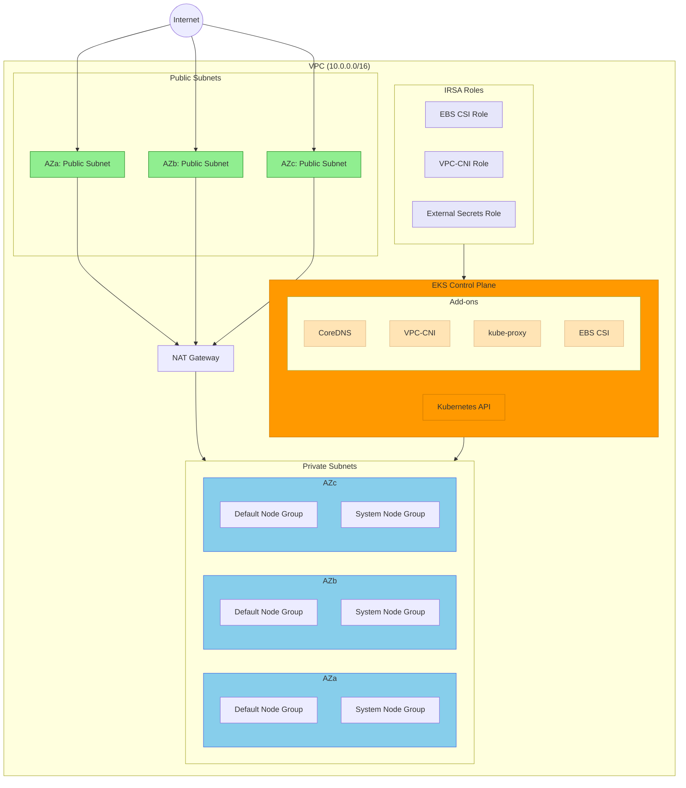

# AWS EKS Infrastructure

This module provisions a production-ready Amazon EKS cluster with VPC networking on AWS using OpenTofu/Terraform.

## Architecture



## Features

- **VPC**: Multi-AZ VPC with public, private, intra, and database subnets
- **EKS**: Managed Kubernetes cluster with configurable version (default: 1.32)
- **Node Groups**: Two managed node groups (default + system with taints)
- **Add-ons**: CoreDNS, kube-proxy, VPC-CNI (with prefix delegation), and EBS CSI driver
- **IRSA**: IAM Roles for Service Accounts
  - EBS CSI Driver
  - VPC CNI
  - External Secrets Operator
- **Security**: VPC Flow Logs, CloudWatch logging, private endpoint enabled
- **OS Support**: AL2023 (default) or Bottlerocket

## Prerequisites

- [OpenTofu](https://opentofu.org/) >= 1.6.0 or [Terraform](https://terraform.io/) >= 1.6.0
- [AWS CLI](https://aws.amazon.com/cli/) configured with appropriate credentials
- AWS account with permissions to create VPC, EKS, IAM resources

## Quick Start

1. **Clone and configure**

   ```bash
   cd iac
   cp terraform.tfvars.example terraform.tfvars
   # Edit terraform.tfvars with your values
   ```

2. **Initialize**

   ```bash
   tofu init
   ```

3. **Plan and apply**

   ```bash
   tofu plan
   tofu apply
   ```

4. **Configure kubectl**
   ```bash
   aws eks update-kubeconfig --name <cluster-name> --region <region> --profile <profile>
   ```

## Example Configuration

```hcl
# terraform.tfvars
name        = "myapp"
project     = "kratix-demo"
environment = "prod"
profile     = "my-aws-profile"
region      = "eu-south-1"
cidr_block  = "10.0.0.0/16"

# EKS Configuration
cluster_name    = "my-eks-cluster"
cluster_version = "1.32"

# Node Configuration
instance_types = ["t3.large"]
node_count     = 3
node_count_min = 1
node_count_max = 6

# Security - Restrict public access to your IP
cluster_endpoint_public_access_cidrs = ["YOUR.PUBLIC.IP/32"]

# Use Bottlerocket OS (optional)
# ami_type        = "BOTTLEROCKET_x86_64"
# ami_type_system = "BOTTLEROCKET_x86_64"
```

## Node Groups

| Node Group | Purpose                                 | Taints                        |
| ---------- | --------------------------------------- | ----------------------------- |
| `default`  | Application workloads                   | None                          |
| `system`   | System components (monitoring, logging) | `node-type=system:NoSchedule` |

### Using System Nodes

To schedule pods on system nodes, add tolerations:

```yaml
tolerations:
  - key: "node-type"
    operator: "Equal"
    value: "system"
    effect: "NoSchedule"
nodeSelector:
  node-type: system
```

## IRSA (IAM Roles for Service Accounts)

This module creates IRSA roles for the following components:

| Role | Service Account | Namespace | Purpose |
| ---- | --------------- | --------- | ------- |
| EBS CSI | `ebs-csi-controller-sa` | `kube-system` | EBS volume management |
| VPC CNI | `aws-node` | `kube-system` | Pod networking |
| External Secrets | `external-secrets` | `external-secrets` | AWS Secrets Manager/SSM access |

### External Secrets Configuration

The External Secrets role has access to:
- **Secrets Manager**: `arn:aws:secretsmanager:<region>:<account>:secret:kratix/*`
- **SSM Parameter Store**: `arn:aws:ssm:<region>:<account>:parameter/kratix/*`

To use External Secrets Operator, annotate your ServiceAccount:

```yaml
apiVersion: v1
kind: ServiceAccount
metadata:
  name: external-secrets
  namespace: external-secrets
  annotations:
    eks.amazonaws.com/role-arn: <external_secrets_role_arn from outputs>
```

## Bottlerocket Support

To use [Bottlerocket OS](https://aws.amazon.com/bottlerocket/) instead of AL2023:

```hcl
# For x86_64 instances
ami_type        = "BOTTLEROCKET_x86_64"
ami_type_system = "BOTTLEROCKET_x86_64"

# For ARM/Graviton instances
ami_type        = "BOTTLEROCKET_ARM_64"
ami_type_system = "BOTTLEROCKET_ARM_64"

# Optional: Enable admin container for debugging
bottlerocket_admin_container_enabled = true
```

## CI/CD

This project includes a GitHub Actions workflow (`.github/workflows/terraform-ci.yaml`) that runs:

1. **Format Check** - `tofu fmt -check`
2. **Validate** - `tofu validate`
3. **TFLint** - Terraform linting with AWS rules
4. **Trivy** - Security scanning for misconfigurations

### Local Validation

```bash
# Format
tofu fmt -recursive

# Validate
tofu init -backend=false
tofu validate

# Lint
tflint --init
tflint --recursive

# Security scan
trivy config --skip-dirs .terraform .
```

<!-- BEGIN_TF_DOCS -->

## Requirements

| Name                                                                        | Version  |
| --------------------------------------------------------------------------- | -------- |
| <a name="requirement_terraform"></a> [terraform](#requirement_terraform)    | >= 1.6.0 |
| <a name="requirement_aws"></a> [aws](#requirement_aws)                      | ~> 6.0   |
| <a name="requirement_helm"></a> [helm](#requirement_helm)                   | >= 2.0   |
| <a name="requirement_kubernetes"></a> [kubernetes](#requirement_kubernetes) | >= 2.30  |
| <a name="requirement_tls"></a> [tls](#requirement_tls)                      | >= 4.0   |

## Providers

| Name                                             | Version |
| ------------------------------------------------ | ------- |
| <a name="provider_aws"></a> [aws](#provider_aws) | ~> 6.0  |

## Modules

| Name                                                                                      | Source                                                         | Version |
| ----------------------------------------------------------------------------------------- | -------------------------------------------------------------- | ------- |
| <a name="module_eks"></a> [eks](#module_eks)                                              | terraform-aws-modules/eks/aws                                  | 21.10.1 |
| <a name="module_irsa_ebs_csi"></a> [irsa_ebs_csi](#module_irsa_ebs_csi)                   | terraform-aws-modules/iam/aws//modules/iam-role-for-service-accounts | 6.2.3   |
| <a name="module_irsa_vpc_cni"></a> [irsa_vpc_cni](#module_irsa_vpc_cni)                   | terraform-aws-modules/iam/aws//modules/iam-role-for-service-accounts | 6.2.3   |
| <a name="module_irsa_external_secrets"></a> [irsa_external_secrets](#module_irsa_external_secrets) | terraform-aws-modules/iam/aws//modules/iam-role-for-service-accounts | 6.2.3   |
| <a name="module_vpc"></a> [vpc](#module_vpc)                                              | terraform-aws-modules/vpc/aws                                  | 6.5.1   |

## Resources

| Name                                                                                                                                  | Type        |
| ------------------------------------------------------------------------------------------------------------------------------------- | ----------- |
| [aws_iam_policy.eks_full_access](https://registry.terraform.io/providers/hashicorp/aws/latest/docs/resources/iam_policy)              | resource    |
| [aws_iam_role_policy.external_secrets_policy](https://registry.terraform.io/providers/hashicorp/aws/latest/docs/resources/iam_role_policy) | resource |
| [aws_availability_zones.available](https://registry.terraform.io/providers/hashicorp/aws/latest/docs/data-sources/availability_zones) | data source |
| [aws_caller_identity.current](https://registry.terraform.io/providers/hashicorp/aws/latest/docs/data-sources/caller_identity)         | data source |
| [aws_eks_cluster_auth.cluster](https://registry.terraform.io/providers/hashicorp/aws/latest/docs/data-sources/eks_cluster_auth)       | data source |
| [aws_iam_policy.ecr_readonly_policy](https://registry.terraform.io/providers/hashicorp/aws/latest/docs/data-sources/iam_policy)       | data source |

## Inputs

| Name                                                                                                                                                | Description                                                                                            | Type           | Default                    | Required |
| --------------------------------------------------------------------------------------------------------------------------------------------------- | ------------------------------------------------------------------------------------------------------ | -------------- | -------------------------- | :------: |
| <a name="input_additional_tags"></a> [additional_tags](#input_additional_tags)                                                                      | Additional tags to apply to all resources.                                                             | `map(string)`  | `{}`                       |    no    |
| <a name="input_ami_type"></a> [ami_type](#input_ami_type)                                                                                           | The AMI type of the EKS cluster nodes (AL2023, AL2, or Bottlerocket).                                  | `string`       | `"AL2023_x86_64_STANDARD"` |    no    |
| <a name="input_ami_type_system"></a> [ami_type_system](#input_ami_type_system)                                                                      | The AMI type of the EKS system node group (AL2023, AL2, or Bottlerocket).                              | `string`       | `"AL2023_x86_64_STANDARD"` |    no    |
| <a name="input_az_count"></a> [az_count](#input_az_count)                                                                                           | The number of availability zones to use.                                                               | `number`       | `3`                        |    no    |
| <a name="input_bottlerocket_admin_container_enabled"></a> [bottlerocket_admin_container_enabled](#input_bottlerocket_admin_container_enabled)       | Enable the Bottlerocket admin container for debugging.                                                 | `bool`         | `false`                    |    no    |
| <a name="input_bottlerocket_control_container_enabled"></a> [bottlerocket_control_container_enabled](#input_bottlerocket_control_container_enabled) | Enable the Bottlerocket control container.                                                             | `bool`         | `true`                     |    no    |
| <a name="input_cidr_block"></a> [cidr_block](#input_cidr_block)                                                                                     | The CIDR block for the VPC.                                                                            | `string`       | n/a                        |   yes    |
| <a name="input_cluster_endpoint_public_access"></a> [cluster_endpoint_public_access](#input_cluster_endpoint_public_access)                         | Enable public access to the EKS cluster endpoint                                                       | `bool`         | `true`                     |    no    |
| <a name="input_cluster_endpoint_public_access_cidrs"></a> [cluster_endpoint_public_access_cidrs](#input_cluster_endpoint_public_access_cidrs)       | List of CIDR blocks to allow public access to the EKS cluster endpoint. Use your IP/CIDR for security. | `list(string)` | `["0.0.0.0/0"]`            |    no    |
| <a name="input_cluster_name"></a> [cluster_name](#input_cluster_name)                                                                               | EKS cluster name.                                                                                      | `string`       | `"eks-cluster"`            |    no    |
| <a name="input_cluster_version"></a> [cluster_version](#input_cluster_version)                                                                      | Kubernetes `<major>.<minor>` version to use for the EKS cluster (i.e.: `1.32`)                         | `string`       | `"1.32"`                   |    no    |
| <a name="input_disk_size"></a> [disk_size](#input_disk_size)                                                                                        | The disk size of the EKS cluster nodes.                                                                | `number`       | `80`                       |    no    |
| <a name="input_disk_size_system"></a> [disk_size_system](#input_disk_size_system)                                                                   | The disk size of the EKS system node group nodes.                                                      | `number`       | `80`                       |    no    |
| <a name="input_environment"></a> [environment](#input_environment)                                                                                  | The environment to deploy the application.                                                             | `string`       | `"prod"`                   |    no    |
| <a name="input_instance_types"></a> [instance_types](#input_instance_types)                                                                         | The instance type of the EKS cluster nodes.                                                            | `list(string)` | `["t3.large"]`             |    no    |
| <a name="input_instance_types_system"></a> [instance_types_system](#input_instance_types_system)                                                    | The instance type of the EKS system node group nodes.                                                  | `list(string)` | `["t3.large"]`             |    no    |
| <a name="input_name"></a> [name](#input_name)                                                                                                       | The name of the application.                                                                           | `string`       | n/a                        |   yes    |
| <a name="input_node_count"></a> [node_count](#input_node_count)                                                                                     | The number of nodes in the EKS cluster.                                                                | `number`       | `3`                        |    no    |
| <a name="input_node_count_max"></a> [node_count_max](#input_node_count_max)                                                                         | The maximum number of nodes in the EKS cluster.                                                        | `number`       | `6`                        |    no    |
| <a name="input_node_count_max_system"></a> [node_count_max_system](#input_node_count_max_system)                                                    | The maximum number of nodes in the system node group.                                                  | `number`       | `6`                        |    no    |
| <a name="input_node_count_min"></a> [node_count_min](#input_node_count_min)                                                                         | The minimum number of nodes in the EKS cluster.                                                        | `number`       | `1`                        |    no    |
| <a name="input_node_count_min_system"></a> [node_count_min_system](#input_node_count_min_system)                                                    | The minimum number of nodes in the system node group.                                                  | `number`       | `1`                        |    no    |
| <a name="input_node_count_system"></a> [node_count_system](#input_node_count_system)                                                                | The number of nodes in the system node group.                                                          | `number`       | `3`                        |    no    |
| <a name="input_node_group_name"></a> [node_group_name](#input_node_group_name)                                                                      | Name of the EKS node group                                                                             | `string`       | `"node-group-app"`         |    no    |
| <a name="input_node_group_name_system"></a> [node_group_name_system](#input_node_group_name_system)                                                 | Name of the EKS system node group                                                                      | `string`       | `"node-group-system"`      |    no    |
| <a name="input_profile"></a> [profile](#input_profile)                                                                                              | The AWS profile to use.                                                                                | `string`       | n/a                        |   yes    |
| <a name="input_project"></a> [project](#input_project)                                                                                              | The project name.                                                                                      | `string`       | n/a                        |   yes    |
| <a name="input_region"></a> [region](#input_region)                                                                                                 | The AWS region to deploy resources.                                                                    | `string`       | `"eu-south-1"`             |    no    |

## Outputs

| Name                                                                                                                                      | Description                                                         |
| ----------------------------------------------------------------------------------------------------------------------------------------- | ------------------------------------------------------------------- |
| <a name="output_cluster_certificate_authority_data"></a> [cluster_certificate_authority_data](#output_cluster_certificate_authority_data) | Base64 encoded certificate data for the cluster                     |
| <a name="output_cluster_endpoint"></a> [cluster_endpoint](#output_cluster_endpoint)                                                       | The endpoint for the EKS cluster API server                         |
| <a name="output_cluster_name"></a> [cluster_name](#output_cluster_name)                                                                   | The name of the EKS cluster                                         |
| <a name="output_cluster_oidc_issuer_url"></a> [cluster_oidc_issuer_url](#output_cluster_oidc_issuer_url)                                  | The URL on the EKS cluster for the OpenID Connect identity provider |
| <a name="output_current_identity"></a> [current_identity](#output_current_identity)                                                       | The ARN of the current AWS caller identity                          |
| <a name="output_external_secrets_role_arn"></a> [external_secrets_role_arn](#output_external_secrets_role_arn)                            | IAM role ARN for External Secrets Operator                          |
| <a name="output_private_subnets"></a> [private_subnets](#output_private_subnets)                                                          | List of IDs of private subnets                                      |
| <a name="output_public_subnets"></a> [public_subnets](#output_public_subnets)                                                             | List of IDs of public subnets                                       |
| <a name="output_region"></a> [region](#output_region)                                                                                     | AWS region                                                          |
| <a name="output_profile"></a> [profile](#output_profile)                                                                                  | AWS CLI profile                                                     |
| <a name="output_validation_errors"></a> [validation_errors](#output_validation_errors)                                                    | List of validation errors (empty if all validations pass)           |
| <a name="output_vpc_id"></a> [vpc_id](#output_vpc_id)                                                                                     | The ID of the VPC                                                   |

<!-- END_TF_DOCS -->

## Security Considerations

1. **Restrict Public Access**: Change `cluster_endpoint_public_access_cidrs` from `0.0.0.0/0` to your IP
2. **Use Private Endpoint**: Set `cluster_endpoint_public_access = false` for production
3. **VPC Flow Logs**: Enabled by default for network monitoring
4. **CloudWatch Logs**: All control plane logs enabled (API, audit, authenticator, controller, scheduler)
5. **IRSA**: Service accounts use scoped IAM roles instead of node instance roles

## Cleanup

```bash
tofu destroy
```
